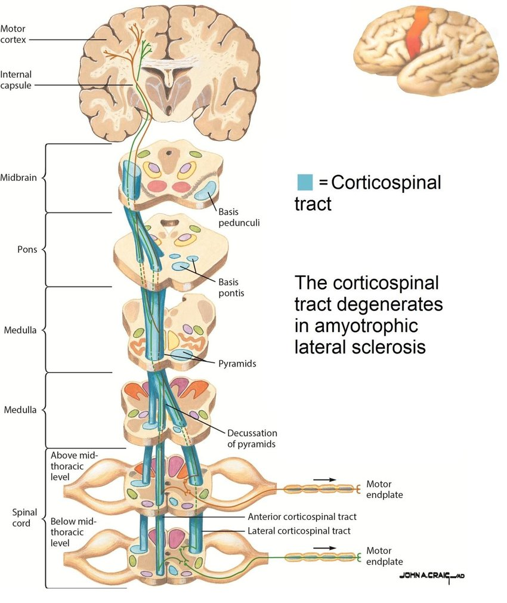

# Corticospinal Tract Anatomy

A short anatomical primer for users new to motor-system neuroanatomy. Adapted from the thesis (Nalo, 2026).

## Why the CST matters

The corticospinal tract (CST) is the principal descending motor pathway responsible for voluntary movement. It is the principal target of upper motor neuron degeneration in amyotrophic lateral sclerosis (ALS) — a fatal neurodegenerative disease characterised by progressive weakness of voluntary skeletal muscles, including those of movement, swallowing, speech and respiration [(Feldman et al., 2022)](references.md#feldman_amyotrophic_2022). Microstructural change in the CST detectable by DTI is therefore a candidate biomarker for ALS disease progression.

## Trajectory

The majority of CST axons originate in the **primary motor cortex** (precentral gyrus), with smaller contributions from premotor and somatosensory cortices. From the cortex, axons descend through:

1. **Corona radiata** — fan-shaped convergence of fibres from distributed cortical motor areas.
2. **Posterior limb of the internal capsule (PLIC)** — a compact bottleneck where motor fibres are densely packed. Anatomically critical for atlas-based ROI placement: the PLIC concentrates the bundle into a small volume that registration must hit accurately.
3. **Cerebral peduncles** of the midbrain.
4. **Brainstem** — midbrain → pons → medulla, maintaining a largely organised arrangement throughout.

*CST (blue) conveying motor signals from the cortex to the skeletal muscles. Figure adapted from [Roos, 2013](references.md#roos_studies_2013).*

## Decussation and contralateral control

At the junction between brainstem and spinal cord — the **caudal medulla** — the majority of CST fibres cross the midline in the **pyramidal decussation**. After decussation, fibres descend within the lateral columns of the spinal cord and terminate at different spinal levels, synapsing onto interneurons and lower motor neurons that ultimately innervate skeletal muscles [(Welniarz et al., 2017)](references.md#welniarz_corticospinal_2017). The crossing is the reason each motor cortex hemisphere controls voluntary movement on the **contralateral** side of the body.

## Landmarks csttool uses

To extract the CST, csttool places ROIs at two anatomical landmarks:

- **Motor cortex** — derived from the Harvard-Oxford cortical atlas (precentral gyrus). Defines the *upper* endpoint.
- **Brainstem** — derived from the Harvard-Oxford subcortical atlas. Defines the *lower* endpoint. Streamlines that touch both ROIs (under `--extraction-method endpoint`) are retained.

The PLIC is a critical intermediate landmark in the human anatomy but is **not** enforced as a constraint by csttool — endpoint filtering alone accepts any streamline connecting the two ROIs. This is a deliberate trade-off discussed in [Known Limitations](limitations.md).

## Pathology in ALS

Post-mortem studies show that CST columns undergo degeneration and sclerosis in ALS, reflecting loss of axons and associated myelin. The change is typically **bilateral but asymmetric**: both hemispheres are affected, but to differing degrees. This makes the CST a natural target for diffusion-MRI studies that aim to quantify disease-related changes in white-matter integrity. Microstructural changes are not visible on conventional structural MRI, but they alter water diffusion enough to be detected by DTI — typically as decreased FA and increased MD/RD along the tract [(Sarica et al., 2017)](references.md#sarica_corticospinal_2017).

The bilateral-but-asymmetric nature of the change motivates csttool's hemispheric **laterality index** in the metrics report:

$$ \mathrm{LI} = \frac{\mathrm{Left} - \mathrm{Right}}{\mathrm{Left} + \mathrm{Right}} $$

reported per scalar metric.

## Caveats

csttool extracts **CST candidate bundles**, not histologically pure reconstructions. DTI cannot resolve all crossing fibres, atlas-to-subject registration has finite precision, and the pipeline constrains the motor-cortex and brainstem endpoints but not all intermediate landmarks. See [Known Limitations](limitations.md) for a full discussion.
