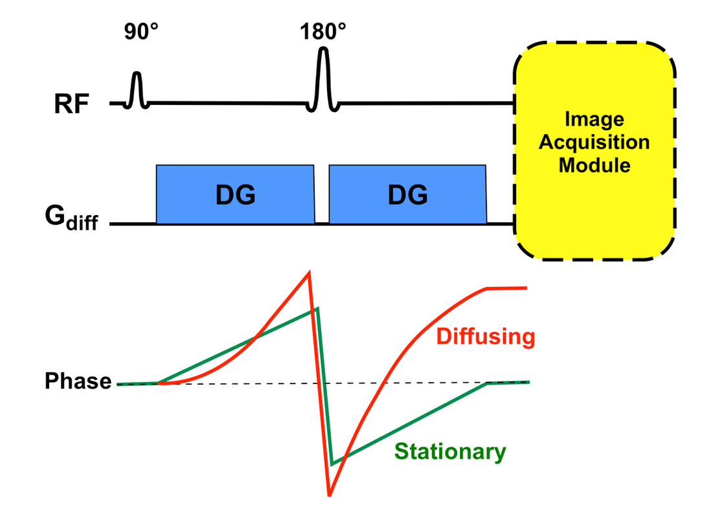
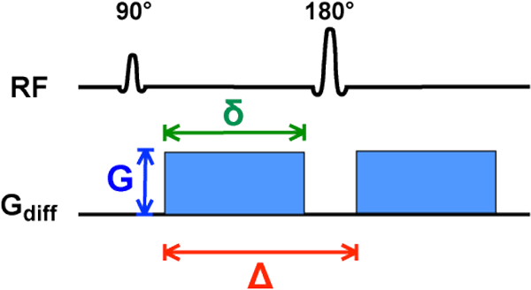
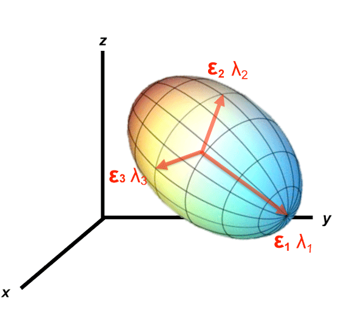
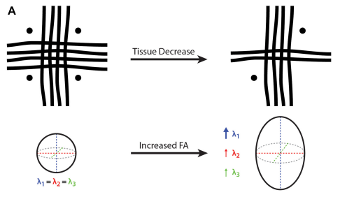
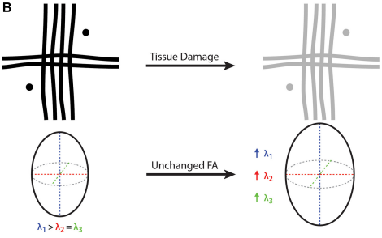

# Diffusion MRI Fundamentals

This page summarises the imaging physics csttool depends on. It is adapted from the corresponding chapter of the thesis (Nalo, 2026) and follows the same notation. For a deeper treatment, see [Soares et al., 2013](references.md#soares_hitchhikers_2013).

## Diffusion and tissue microstructure

Diffusion-weighted imaging (DWI) generates image contrast from the diffusion of water molecules. Diffusion — Brownian motion — refers to the random thermal movement of particles. In a homogeneous medium, diffusion is **isotropic**: equal in all directions. In biological tissue, cellular structures such as membranes, organelles and (in white matter) axonal walls and myelin sheaths hinder free motion, so diffusion becomes **anisotropic**. The degree and orientation of this anisotropy reflect tissue microstructure and change under pathological conditions, which makes DWI an essential tool in neuroimaging.

## How diffusion contrast is generated

To sensitise the MR signal to diffusion, a pair of diffusion gradients (DGs) is applied around a refocusing 180° pulse in a spin-echo sequence. For stationary spins, the phase accumulated under the first gradient is fully reversed by the second. For diffusing spins, however, the spin has moved to a different magnetic environment in the interval between the two gradients, so refocusing is incomplete and the signal decays. This creates contrast between stationary and diffusing populations.

*Effect of diffusion gradients on stationary and diffusing spins. Figure courtesy of Allen D. Elster, MRIquestions.com.*

## The b-value

The strength of the diffusion weighting is controlled by the operator through the **b-value**, which governs how quickly the signal decays:

$$ S(b) = S_0 \exp(-bD) $$

where $S_0$ is the signal without diffusion weighting and $D$ is the diffusion coefficient. For rectangular pulses ([Stejskal & Tanner, 1965](references.md#stejskal_spin_1965)):

$$ b = \gamma^2 G^2 \delta^2 (\Delta - \delta/3) $$

with $\gamma$ the gyromagnetic ratio, $G$ the gradient amplitude, $\delta$ the gradient duration, and $\Delta$ the inter-gradient interval. The b-value has units of s/mm². Routine clinical DWI uses b-values in the 0–1000 s/mm² range, with 1000 s/mm² being the standard for many pathologies [(Kazemzadeh et al., 2025)](references.md#kazemzadeh_role_2025).

*Illustration of the b-value parameters. Figure courtesy of Allen D. Elster, MRIquestions.com.*

## The diffusion tensor

The scalar diffusion coefficient $D$ is an over-simplification: it assumes isotropic motion. The **diffusion tensor** $\mathcal{D}$ extends $D$ by encoding both magnitude and direction:

$$ \mathcal{D} = \begin{bmatrix} D_{xx} & D_{xy} & D_{xz} \\ D_{yx} & D_{yy} & D_{yz} \\ D_{zx} & D_{zy} & D_{zz} \end{bmatrix} $$

Eigenvalue decomposition yields three eigenvectors $\mathbf{v}_i$ (principal directions of diffusion) and eigenvalues $\lambda_i$ (their magnitudes). Geometrically, this maps to an ellipsoid oriented along $\mathbf{v}_i$ and scaled by $\sqrt{\lambda_i}$.

*Diffusion ellipsoid with eigenvector directions $\mathbf{\epsilon}_i$ and eigenvalue magnitudes $\lambda_i$. Figure courtesy of Allen D. Elster, MRIquestions.com.*

A minimum of six gradient directions are required to fit the tensor; in practice ≥30 (preferably ≥64) are used to suppress error from crossing, kissing or branching fibres.

## DTI scalar metrics

Diffusion tensor imaging (DTI) summarises the tensor with four scalars. csttool reports all four.

| Metric | Definition | Interpretation |
|---|---|---|
| Axial diffusivity (AD) | $\lambda_1$ | Diffusion along the principal axis. |
| Radial diffusivity (RD) | $(\lambda_2 + \lambda_3)/2$ | Mean perpendicular diffusion. |
| Mean diffusivity (MD) | $(\lambda_1 + \lambda_2 + \lambda_3)/3$ | Direction-independent average. |
| Fractional anisotropy (FA) | $\sqrt{\frac{(\lambda_1-\lambda_2)^2 + (\lambda_2-\lambda_3)^2 + (\lambda_3-\lambda_1)^2}{2(\lambda_1^2 + \lambda_2^2 + \lambda_3^2)}}$ | Relative anisotropy in $[0, 1]$. |

In healthy adult white matter, typical CST values at 3 T are FA ≈ 0.58, MD ≈ 0.79 × 10⁻³ mm²/s, AD ≈ 1.4 × 10⁻³ mm²/s, RD ≈ 0.50 × 10⁻³ mm²/s [(Reich et al., 2006)](references.md#reich2006quantitative). In ALS, FA decreases and MD/RD increase along the CST relative to controls, reflecting loss of axonal integrity [(Sarica et al., 2017)](references.md#sarica_corticospinal_2017).

## DTI limitations in crossing-fibre voxels

FA is a *relative* measure and can behave counter-intuitively in voxels containing crossing fibres [(Figley et al., 2022)](references.md#figley_potential_2022).

*Left: FA = 0 (no dominant direction). Right: fibre loss causes $\lambda_1$ to increase relative to $\lambda_2$ and $\lambda_3$, raising FA despite a net loss of tissue.*

*Left: a principal orientation gives FA > 0. Right: proportional degradation of all eigenvalues leaves FA unchanged despite microstructural damage. Figures adapted from [Figley et al., 2022](references.md#figley_potential_2022).*

These limitations do not disqualify DTI: non-relative metrics such as MD or the trace ($\lambda_1 + \lambda_2 + \lambda_3$) are more robust in crossing-fibre regions, and the CST itself is anatomically simple enough that crossing-fibre confounds are limited. Clinical interpretation should always corroborate DTI with other imaging metrics.

## Software used

- **DIPY** ([Garyfallidis et al., 2014](references.md#garyfallidis_dipy_2014)) — tensor fitting, scalar metrics.
- **Patch2Self** denoising — see the [`preprocess` reference](../reference/cli/preprocess.md).

See [Tractography](tractography.md) for how the principal eigenvectors are turned into 3D streamlines, and [CST Anatomy](cst-anatomy.md) for the anatomical context.
