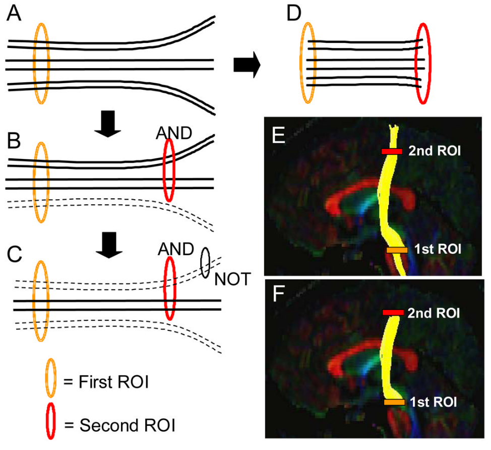

# Tractography

This page explains how csttool turns voxel-wise diffusion measurements into three-dimensional streamlines and how those streamlines are filtered into the bilateral CST. It is adapted from the thesis (Nalo, 2026).

## Purpose

The principal eigenvector of the diffusion tensor $\mathcal{D}$ encodes the local orientation of white matter at each voxel. **Tractography** is the technique of projecting these local orientations into 3D trajectories that approximate fibre pathways *in vivo*, enabling both visualisation and quantitative analysis of named bundles [(Soares et al., 2013)](references.md#soares_hitchhikers_2013).

Every tractography algorithm shares three stages:

1. **Seeding** — choose starting points.
2. **Propagation** — step from each seed by following the local direction estimate.
3. **Termination** — stop when a criterion is violated (FA threshold, angle threshold, brain-mask boundary, length limit).

## Deterministic vs probabilistic

In **deterministic** tractography, propagation follows the dominant local direction. Given the current position $\mathbf{x}_t$ and step size $h$:

$$ \mathbf{x}_{t+1} = \mathbf{x}_t + h \cdot \mathbf{v}_1(\mathbf{x}_t) $$

Given identical inputs and parameters, deterministic tractography is reproducible bit-for-bit. Every streamline has a single, traceable history.

In **probabilistic** tractography, the local direction at each step is sampled from an orientation distribution function (ODF) rather than read off deterministically [(Lazar, 2010)](references.md#lazar_mapping_2010). Repeated runs from the same seed produce a distribution of plausible paths. This is useful in regions with low FA or many crossing fibres, but it sacrifices reproducibility and produces an order of magnitude more streamlines for the same anatomy.

**csttool uses deterministic tractography by design.** The motivation is methodological transparency: identical inputs must produce identical streamlines so that downstream metric differences are attributable to data, not stochasticity. This rationale and its trade-offs are discussed further in [Design Decisions](design-decisions.md) and [Known Limitations](limitations.md).

## Direction estimation: CSA-ODF

The raw DTI eigenvector $\mathbf{v}_1$ is a reasonable propagation direction in voxels with a single dominant fibre, but it fails in crossing-fibre voxels (see [Diffusion MRI](diffusion-mri.md#dti-limitations-in-crossing-fibre-voxels)). csttool therefore uses the **constant solid angle ODF** (CSA-ODF) of [Aganj et al., 2010](references.md#aganj2010reconstruction).

The ODF is the marginal probability of diffusion in a given direction $\hat{u}$:

$$ \mathrm{ODF}(\hat{u}) = \int_0^\infty P(r\hat{u})\, r^2\, dr $$

The $r^2$ factor — the spherical volume element — distinguishes CSA-ODF from the earlier q-ball formulation, which produced a non-normalised quantity requiring post-hoc sharpening. Under a mono-exponential model for the normalised signal $\tilde{E}(\hat{u}) = S(\hat{u})/S_0$, CSA-ODF admits a closed-form expression:

$$ \mathrm{ODF}(\hat{u}) = \tfrac{1}{4\pi} + \tfrac{1}{16\pi^2}\, \mathrm{FRT}\!\left\{\nabla_b^2 \ln\!\left(-\ln \tilde{E}(\hat{u})\right)\right\} $$

where FRT is the Funk-Radon transform and $\nabla_b^2$ is the Laplace-Beltrami operator. csttool expands $\ln(-\ln \tilde{E})$ in a real symmetric spherical-harmonic basis of order $l$ (default `--sh-order 6`, giving $R = (l+1)(l+2)/2 = 28$ coefficients), and the operators above become per-coefficient scalar multiplications. The dominant peak of the local CSA-ODF replaces the DTI eigenvector in the deterministic step rule above, giving an accurate direction field in crossing-fibre voxels while preserving deterministic reproducibility.

CSA-ODF is **single-shell**: it requires only one non-zero b-value. This is a deliberate choice — multi-shell methods such as constrained spherical deconvolution (CSD) demand acquisition protocols that are not always available clinically.

## Stopping criteria

csttool combines:

- **FA threshold** — `--fa-thr 0.2` by default. Streamlines stop where the FA map drops below this value (typical white-matter / grey-matter boundary).
- **Streamline length** — `--min-length 20.0` and `--max-length 200.0` mm reject implausibly short or long bundles.
- **Brain mask** — with `--use-brain-mask-stop`, the brain mask becomes a hard boundary.

## Atlas-based ROI filtering

A whole-brain run typically yields $10^6$–$10^7$ streamlines. Isolating the CST requires anatomical filtering. The gold standard is expert manual ROI placement, but it is slow, requires specialist skill, and is operator-dependent. csttool uses **atlas-based filtering**: anatomical ROIs (motor cortex, brainstem) are transferred from a standard-space atlas to the subject's native diffusion space via image registration, then used to filter streamlines.

### Filtering strategies

Two strategies are exposed by [`csttool extract`](../reference/cli/extract.md):

- **Endpoint filtering** (`--extraction-method endpoint`, default) — both the first and last coordinate of a streamline must fall inside an ROI. Strict; high specificity.
- **Passthrough filtering** (`--extraction-method passthrough`) — the streamline must intersect an ROI at any point. More lenient; higher sensitivity.

Both can be composed with logical operations — **AND** (intersection), **NOT** (exclusion) and **CUT** (truncation) [(Wakana et al., 2007)](references.md#wakana2007reproducibility):

*ROI-based streamline filtering operations. (A) initial ROI; (B) AND across two ROIs; (C) NOT exclusion; (D) CUT truncation. Adapted from [Wakana et al., 2007](references.md#wakana2007reproducibility).*

`csttool run` additionally exposes `roi-seeded` and `bidirectional` extraction modes, discussed in [Design Decisions](design-decisions.md).

### Registration

csttool warps atlas ROIs to subject space rather than warping streamlines to atlas space — this preserves the geometry produced during tractography and avoids artefactually deforming streamlines. The registration uses ANTs SyN ([Avants et al., 2008](references.md#avants_symmetric_2008)) with mutual-information–based affine initialisation ([Maes et al., 2003; Mattes et al., 2003](references.md#maes2002multimodality)). For a faster but lower-precision profile, pass `--fast-registration`.

## Software used

- **DIPY** ([Garyfallidis et al., 2014](references.md#garyfallidis_dipy_2014)) — CSA-ODF model, deterministic propagation, streamline I/O.
- **ANTs** — SyN registration.
- **FMRIB58_FA template** — registration target. Downloaded via [`csttool fetch-data`](../reference/cli/fetch-data.md).

## Next

- [`track` CLI reference](../reference/cli/track.md)
- [`extract` CLI reference](../reference/cli/extract.md)
- [Design Decisions](design-decisions.md) — bidirectional seeding, per-side caps, hemispheric asymmetry handling.
